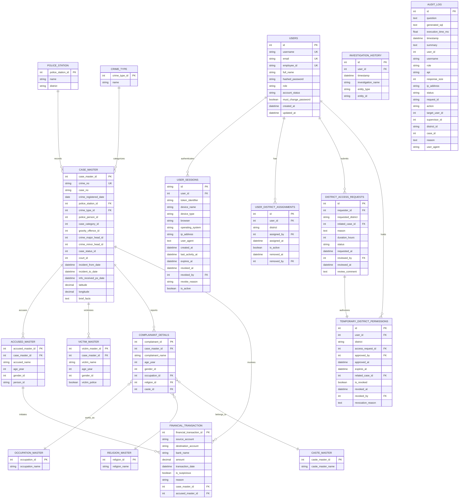

# Karnataka State Police (KSP) — AI-Powered Crime Intelligence Platform

An enterprise-grade, AI-driven Crime Intelligence Platform designed for the **Karnataka State Police (KSP)**. This platform enables police officers, analysts, supervisors, and policymakers to perform natural language database querying (in English and Kannada), visualize criminal network relationships, analyze suspicious financial transactions, view interactive hotspot crime maps, and manage secure district-level data access control (RBAC & ABAC).

---

## 📋 Table of Contents
1. [Problem Statement](#-problem-statement)
2. [Key Features](#-key-features)
3. [System Architecture & Design](#-system-architecture--design)
4. [Technology Stack & Versions](#-technology-stack--versions)
5. [Database ER Diagram & Schema](#-database-er-diagram--schema)
6. [Repository Structure](#-repository-structure)
7. [Installation & Execution Guide](#-installation--execution-guide)
    - [Quick Start with Docker Compose](#1-quick-start-with-docker-compose-recommended)
    - [Manual Local Setup (Step-by-Step)](#2-manual-local-setup-step-by-step)
8. [Access & Role Permissions Matrix](#-access--role-permissions-matrix)

---

## 🔍 Problem Statement
Develop an **AI-powered Crime Intelligence Platform** that enables the **Karnataka State Police** to perform intelligent crime analysis, multilingual natural language querying, criminal network visualization, pattern detection, and secure district-level data access for faster and data-driven investigations.

---

## 🌟 Key Features

*   **🎙️ AI Chat Assistant (Multilingual & Voice-Enabled)**: 
    *   Enables querying of crime records, accused details, and case statuses using natural language in **English, Kannada, or mixed (Kannada + English)** scripts.
    *   Fully integrated with browser-native **Speech-to-Text (STT)** and server-side **hybrid Text-to-Speech (TTS)** using `gTTS` with spoken Kannada translation for numbers/codes.
*   **🔎 Intelligent Crime Search**: Quickly search across FIRs, accused tables, victim master lists, and complainants using semantic parsing and SQL synthesis.
*   **🕸️ Criminal Network Intelligence**: Computes and displays an interactive, force-directed graph connecting accused, victims, cases, and financial transactions using `react-force-graph-2d` and `NetworkX`.
*   **📈 Pattern Intelligence & Forecasting**: Predicts trends and tracks repeat offenders using location and crime head clustering.
*   **💰 Financial Crime Intelligence**: Visualizes currency flows, tracks suspicious banking accounts, flags cash transactions, and maps links between suspects.
*   **🗺️ Interactive Crime Map & Heatmaps**: Features Leaflet maps with marker clustering to isolate crime occurrences, identify geographic hotspots, and show district-level distributions.
*   **📊 Executive Analytics Dashboard**: Real-time analytical indicators, crime timelines, and rankings using interactive `Recharts` graphs.
*   **🔒 Enterprise Access Control (RBAC & ABAC)**: 
    *   **RBAC**: Fine-grained roles from Admin to Analyst, enforcing field masking of sensitive details (e.g. victim names).
    *   **ABAC**: Jurisdictional containment matching officers to their assigned districts. Features a workflow to submit, review, and approve temporary cross-district access request grants.
*   **🛡️ Compliance Audit Logging**: Automatically audits database operations, generated SQLs, exported reports, and security events for accountability.

---

## 🏗️ System Architecture & Design

The platform consists of a three-tier setup containing:
1.  **Frontend Client (React SPA)**: A sleek, dark-mode visual console built with React 19, Vite, and Tailwind CSS v4. Operates a client-side RBAC permission guard and state caching through TanStack Query/Zustand.
2.  **Backend REST Gateway (FastAPI)**: Asynchronous FastAPI server handling authentication, requests routing, speech chunking, and auditing.
3.  **Multi-Agent Coordination Hub**:
    *   **Orchestrator**: Maintains conversation context, processes pronoun resolution, and dispatches to specific sub-agents.
    *   **Query Agent**: Converts natural language to SQL using Gemini, runs query structure safety checks, executes against PostgreSQL, and formats the output.
    *   **Network Agent**: Utilizes `NetworkX` in Python to map structural dependencies and return relation arrays.
4.  **Datastores**: PostgreSQL 16 (persistence) and Redis 7 (conversation contexts, sessions, and API rate-limiting).

```
   ┌────────────────────────────────────────────────────────┐
   │             Visual Console (React 19 Frontend)         │
   └───────────────────────────┬────────────────────────────┘
                               │
                       REST APIs / HTTPS
                               │
                               ▼
┌────────────────────────────────────────────────────────────────────────┐
│                        Backend API (FastAPI)                           │
│                                                                        │
│  ┌──────────────────────┐ ┌──────────────────────┐ ┌────────────────┐  │
│  │    REST Endpoints    │ │  Orchestrator Agent  │ │ Security/RBAC  │  │
│  └──────────┬───────────┘ └──────────┬───────────┘ └───────┬────────┘  │
│             │                        │                     │           │
│             │                ┌───────┴───────┐             │           │
│             │                ▼               ▼             │           │
│             │        ┌──────────────┐ ┌──────────────┐     │           │
│             │        │ Query Agent  │ │Network Agent │     │           │
│             │        └──────┬───────┘ └──────────────┘     │           │
│             │               │                              │           │
└─────────────┼───────────────┼──────────────────────────────┼───────────┘
              │               │                              │
              ▼               ▼                              ▼
     ┌──────────────────────────────────┐         ┌─────────────────────┐
     │      Redis Session Caching       │         │  PostgreSQL Database │
     └──────────────────────────────────┘         └─────────────────────┘
```

---

## 🛠️ Technology Stack & Versions

### Frontend (SPA Console)
*   **React v19.2.0**
*   **Vite v8.0.16**: High-speed build system.
*   **Tailwind CSS v4.2.1**: Styling system.
*   **TanStack Router v1.170.16**: Type-safe routing.
*   **TanStack Query v5.101.1**: Cache management and server sync.
*   **Zustand v5.0.14**: Client state management.
*   **Leaflet v1.9.4 & React Leaflet v5.0.0**: Map engines.
*   **react-force-graph-2d v1.29.1**: Interactive graph visualizations.
*   **Recharts v3.9.1**: Responsive charting.
*   **Axios v1.18.1**: Request client.

### Backend (REST API & AI)
*   **Python v3.11** (Development Base) / **Python v3.12** (Zoho Catalyst AppSail Production Stack)
*   **FastAPI v0.115.5**: Asynchronous python web framework.
*   **Uvicorn v0.32.1**: ASGI server.
*   **SQLAlchemy v2.0.36**: Object Relational Mapper (ORM).
*   **Alembic v1.14.0**: Database migrations engine.
*   **Psycopg v3.2.3**: Database adapter.
*   **Redis v5.2.0 (python library)**: Caching and session handling.
*   **Google GenAI SDK (google-genai >= 1.0.0)**: Interfaces with Gemini LLM.
*   **gTTS v2.5.1**: Text-to-Speech synthesis.
*   **NetworkX >= 3.0** & **NumPy >= 1.20**: Statistical analytics and criminal graph networks.
*   **Bcrypt v4.2.0** & **PyJWT v2.10.1**: Password hashes and token security.

---

## 📊 Database ER Diagram & Schema

The diagram below maps the relationships of all database entities.

### Mermaid Model



---

## 📂 Repository Structure

```
KSP-Crime-Intelligence/
├── backend/                  # FastAPI Application Root
│   ├── alembic/              # Database Migrations scripts
│   ├── app/                  # Application Core Modules
│   │   ├── agents/           # Multi-Agent query layers (Query, Network, Audit)
│   │   ├── api/              # REST Endpoints Controllers
│   │   ├── core/             # Configuration & Security Middlewares
│   │   ├── db/               # Database settings and data seeds
│   │   ├── models/           # SQLAlchemy Data structures models
│   │   ├── nlp/              # Speech & translation layers
│   │   └── schemas/          # API parameters schemas
│   ├── docker/               # Container files
│   └── requirements.txt      # Python dependencies
├── frontend/                 # React SPA Application Root
│   ├── public/               # Static assets & logo icons
│   ├── src/                  # React Source Code
│   │   ├── components/       # Interface units & widgets
│   │   ├── hooks/            # Context custom hooks
│   │   ├── lib/              # Client API clients & RBAC definitions
│   │   ├── routes/           # TanStack router endpoints pages
│   │   └── styles/           # Tailwind themes
│   ├── package.json          # Node dependencies definitions
│   └── tsconfig.json         # TypeScript compiler configurations
├── ER Diagram Latest white.jpg # High-resolution diagram asset
└── docker-compose.yml        # Orchestration configurations
```

---

## 🚀 Installation & Execution Guide

### 1. Quick Start with Docker Compose (Recommended)

Ensure you have **Docker** and **Docker Compose** installed.

1.  **Clone the workspace** and open a terminal.
2.  **Configure environment variables**:
    Copy the sample environment file in `backend/`:
    ```bash
    cp backend/.env.example backend/.env
    ```
    Edit `backend/.env` and configure your **Google Gemini API Key**:
    ```env
    GEMINI_API_KEY=your_actual_api_key_here
    ```
3.  **Start all containers**:
    Run docker compose from the workspace root:
    ```bash
    docker compose -f backend/docker/docker-compose.yml up --build -d
    ```
4.  **Prepare Database**:
    Wait for PostgreSQL and Redis health checks to show healthy, then execute migrations and populate the database with realistic mock data:
    ```bash
    docker exec -it scrb_backend alembic upgrade head
    docker exec -it scrb_backend python scripts/seed_db.py
    ```
5.  **Access details**:
    *   **Frontend client**: `http://localhost:5173` (or port specified during build)
    *   **Backend REST documentation**: `http://localhost:8000/docs`
    *   **pgAdmin dashboard**: `http://localhost:5050` (Login: `admin@scrb.local` / `adminpass`)

---

### 2. Manual Local Setup (Step-by-Step)

#### A. Backend Setup
1.  Navigate into `backend/`:
    ```bash
    cd backend
    ```
2.  Create and activate virtual environment:
    ```bash
    python -m venv .venv
    # Windows:
    .venv\Scripts\activate
    # Linux/Mac:
    source .venv/bin/activate
    ```
3.  Install python dependencies:
    ```bash
    pip install -r requirements.txt
    ```
4.  Create and populate `.env` file containing local PostgreSQL & Redis coordinates.
5.  Run PostgreSQL migration:
    ```bash
    alembic upgrade head
    ```
6.  Seed databases:
    ```bash
    python scripts/seed_db.py
    ```
7.  Start server:
    ```bash
    python run.py
    ```

#### B. Frontend Setup
1.  Navigate into `frontend/`:
    ```bash
    cd ../frontend
    ```
2.  Install dependencies:
    ```bash
    npm install
    # or using Bun
    bun install
    ```
3.  Create `.env` based on `.env.example`:
    ```bash
    cp .env.example .env
    ```
    Verify that `VITE_API_BASE_URL` matches your local backend address (`http://localhost:8000/api/v1`).
4.  Start development server:
    ```bash
    npm run dev
    # or using Bun
    bun run dev
    ```
    The application will launch on `http://localhost:5173`.

---

## 🔒 Access & Role Permissions Matrix

The platform implements fine-grained security policies based on the roles of the KSP personnel.

| Role | Core Mission | Permissions Allowed | Data Scope Constraints |
| :--- | :--- | :--- | :--- |
| **Investigator** | Case exploration & tracking | Search cases, Chat assistant, Crime Map hotspots | Restricted to assigned district details. Can request cross-district permissions. |
| **Senior Investigator** | District-wide criminal networks | Cross-district cases, Criminal graphs, Financial audit tools | Accesses multi-district case files and money tracking logs. |
| **Analyst** | State trend forecasting | Dashboard statistics, Predictive patterns, Hotspot projections | Allowed analytics dashboards; sensitive columns (names, accounts) are masked. |
| **Supervisor** | Jurisdiction control & approval | Access request approval, Case status reviews, System exports | Full access inside district scope. Approves temporary access requests. |
| **Policymaker** | State-level executive trends | Executive dashboards, State heatmaps | State-wide analytics metrics; completely hides all PII and sensitive data. |
| **Admin** | System administration | Complete access, User assignments, Audit logs, Health status | Full unmasked workspace control. |
